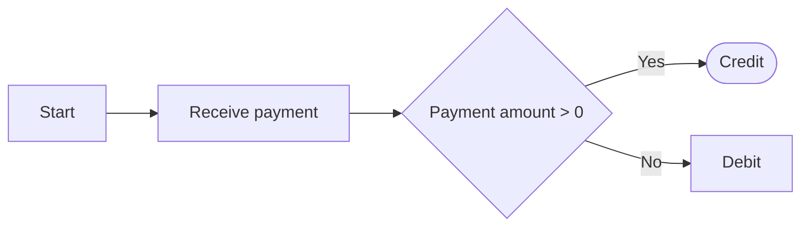
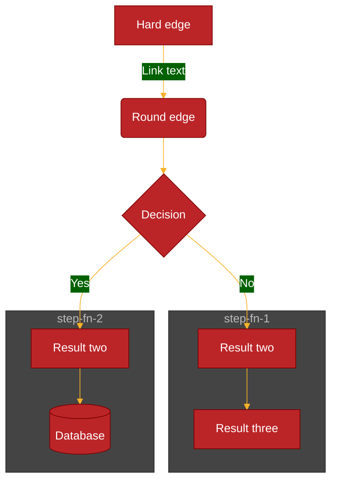

## Flowcharts

If we had a payment business and received a payment amount, from the amount we would need to determine if the payment was a debit or credit. We could write this down but its often clearer to show this in a flowchart.

If we enter the following we are creating a flowchart that flows from left to right

        ```mermaid
        flowchart LR
            A[Start] --> B[Receive payment]
            B --> C{Payment amount > 0}
            C --> |Yes| D([Credit])
            C --> |No| E[Debit]
        ```



For a flowchart we can 
- specify the direction of the flowchart (top down, left - right, right - left, bottom - up)
- specify the style of the arrows
- specify the style of the nodes

Mermaid flowchart shapes can be found [here](https://mermaid-js.github.io/mermaid/#/flowchart?id=flowchart-diagram-syntax)

The below example has two subgraph sections, the first subgraph section has a single node and the second subgraph section has two nodes. The subgraph sections are used to group nodes together.



