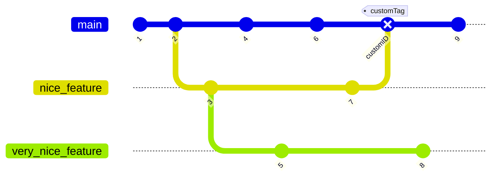

## Gitgraphs

Gitgraphs are a way to visualize the history of a git repository.  They are useful for understanding the history of a repository and for planning future work.

        ```mermaid
        gitGraph
            commit id: "1"
            commit id: "2"
            branch nice_feature
            checkout nice_feature
            commit id: "3"
            checkout main
            commit id: "4"
            checkout nice_feature
            branch very_nice_feature
            checkout very_nice_feature
            commit id: "5"
            checkout main
            commit id: "6"
            checkout nice_feature
            commit id: "7"
            checkout main
            merge nice_feature id: "customID" tag: "customTag" type: REVERSE
            checkout very_nice_feature
            commit id: "8"
            checkout main
            commit id: "9"
        ```

This produces


