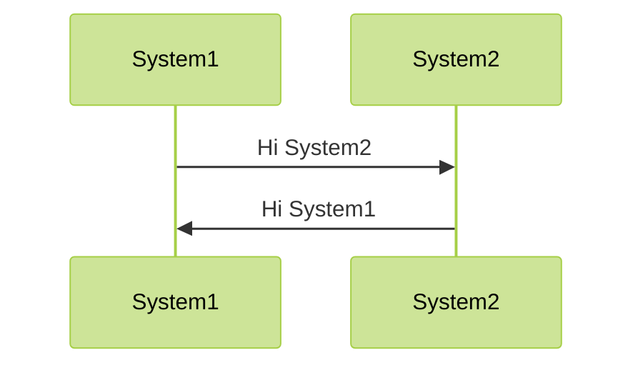
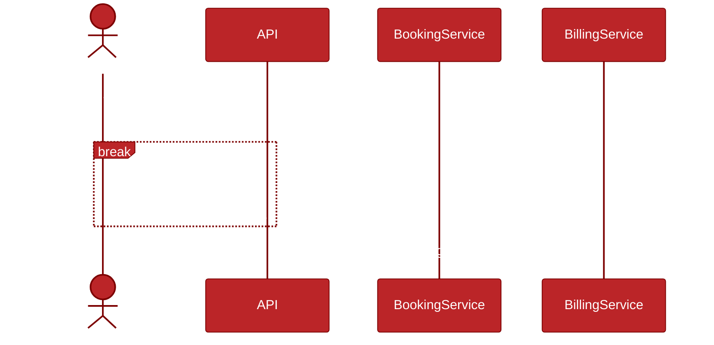

## Sequence Diagrams

A sequence diagram shows the sequence of messages between objects in a system. It shows the order of the messages and the objects that send and receive the messages.

For a sequence diagram we can
- specify the style of the arrows
- specifies loops and conditions
- add notes to the diagram
- add sequence numbering
- and so much more

If two systems interacted with each other we could show this in a sequence diagram. 

        ```mermaid
        %%{
            init: {
                'theme': 'base',
                'themeVariables': {
                'primaryColor': '#BB2528',
                'primaryTextColor': '#fff',
                'primaryBorderColor': '#7C0000',
                'lineColor': '#F8B229',
                'secondaryColor': '#006100',
                'tertiaryColor': '#444',
                'background': '#111',
                }
            }
        }%%
        sequenceDiagram
            participant System1
            participant System2
            System1->>System2: Hi System2
            System2->>System1: Hi System1
        ```

This would produce the below



Sequence diagrams can become far more complex than this and we can change the names to basic images

    ```mermaid
    sequenceDiagram
        actor Consumer
        Consumer-->API: Book something
        API-->BookingService: Start booking process
        break when the booking process fails
            API-->Consumer: show failure
        end
        API-->BillingService: Start billing process
    ```



