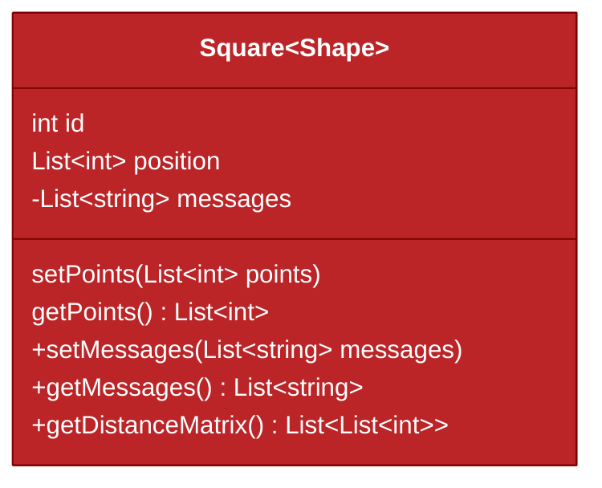
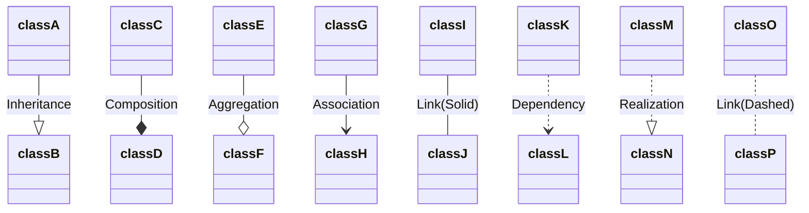

## Class Diagrams

A class diagram shows the classes in a system and the relationships between the classes. It shows the attributes and methods of each class and the relationships between the classes.

