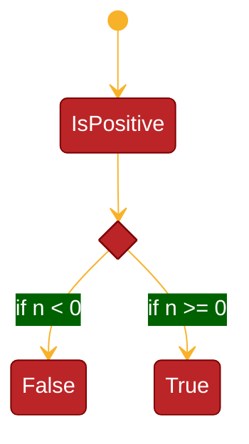

## State Diagrams

State diagrams show the states of an object and the transitions between the states. It shows the events that cause the transitions and the actions that result from the transitions.

        ```mermaid
        stateDiagram-v2
            state if_state <<choice>>
            [*] --> IsPositive
            IsPositive --> if_state
            if_state --> False: if n < 0
            if_state --> True : if n >= 0
        ```

Produces the following


