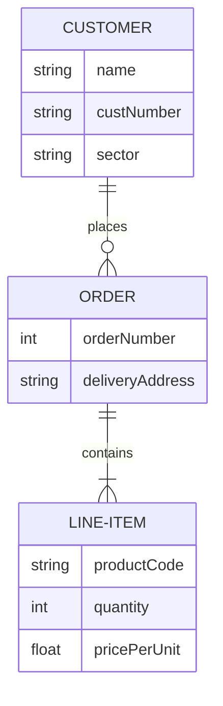

## Entity Diagrams

Entity diagrams show the entities in a system and the relationships between the entities. It shows the attributes of each entity and the relationships between the entities.

The colouring of entity diagrams currently has issues.

