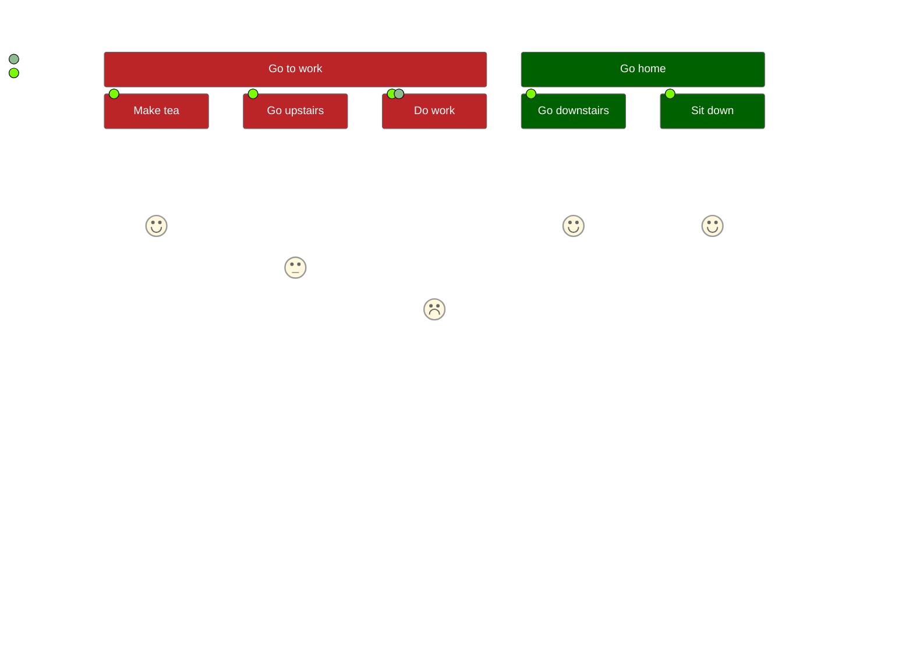

## User Jouneys

User journeys show the steps a user takes to complete a task. It shows the steps the user takes and the actions that result from the steps.

    ```mermaid
    journey
      title My working day
      section Go to work
        Make tea: 5: Me
        Go upstairs: 3: Me
        Do work: 1: Me, Cat
      section Go home
        Go downstairs: 5: Me
        Sit down: 5: Me
    ```

This shows the following user journey (although not mine)


