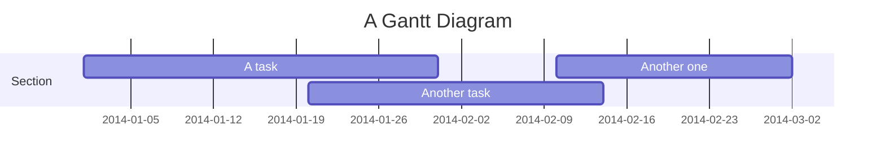

## Gantt Charts

Gantt charts show the tasks in a project and the time taken to complete the tasks. It shows the start and end dates of the tasks and the dependencies between the tasks.

        ```mermaid
        ---
        displayMode: compact
        ---
        gantt
            title A Gantt Diagram
            dateFormat  YYYY-MM-DD

            section Section
            A task           :a1, 2014-01-01, 30d
            Another task     :a2, 2014-01-20, 25d
            Another one      :a3, 2014-02-10, 20d
        ```

This produces


