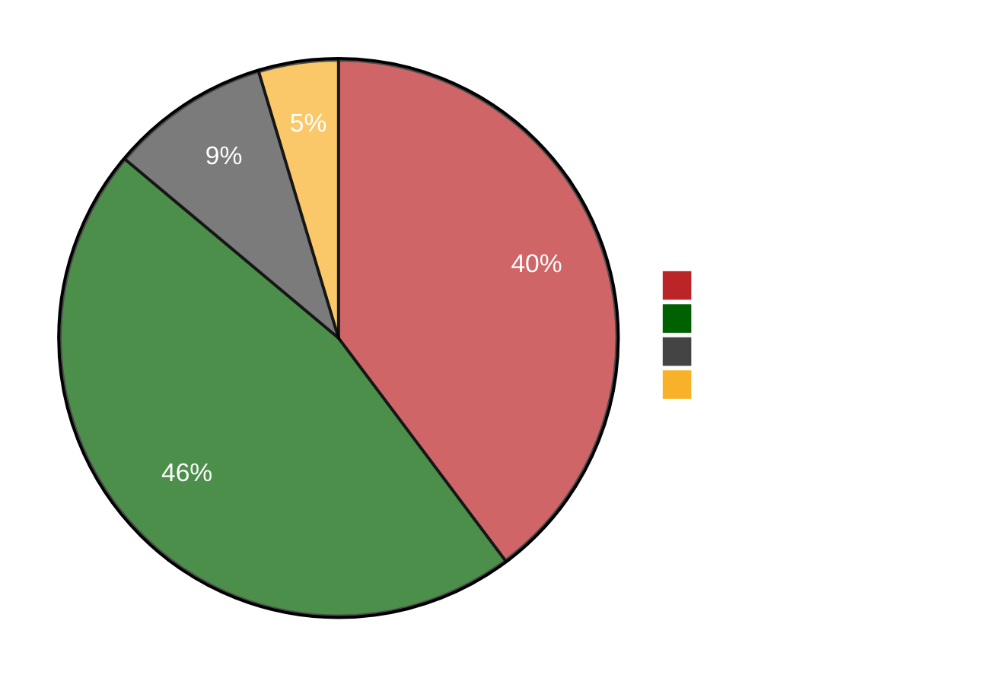

## Pie Charts

Pie charts is produced using the following.

        ```mermaid
        pie showData
            title Key elements in Product X
            "Calcium" : 42.96
            "Potassium" : 50.05
            "Magnesium" : 10.01
            "Iron" :  5
        ```

This produces


