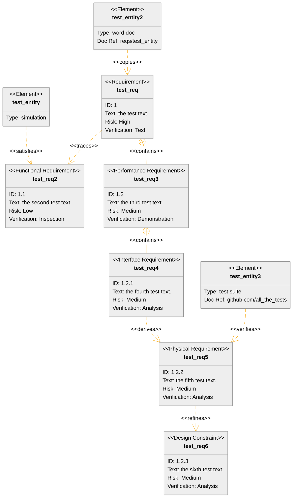

## Requirements Diagram

Requirements diagrams are used to show the relationship between requirements. The requirements are plotted as x and y coordinates. The first requirement is plotted on the x axis and the second requirement is plotted on the y axis. The third requirement is plotted on the x axis and the fourth requirement is plotted on the y axis.

        ```mermaid
        requirementDiagram

            requirement test_req {
                id: 1
                text: the test text.
                risk: high
                verifymethod: test
            }

            functionalRequirement test_req2 {
                id: 1.1
                text: the second test text.
                risk: low
                verifymethod: inspection
            }

            performanceRequirement test_req3 {
                id: 1.2
                text: the third test text.
                risk: medium
                verifymethod: demonstration
            }

            interfaceRequirement test_req4 {
                id: 1.2.1
                text: the fourth test text.
                risk: medium
                verifymethod: analysis
            }

            physicalRequirement test_req5 {
                id: 1.2.2
                text: the fifth test text.
                risk: medium
                verifymethod: analysis
            }

            designConstraint test_req6 {
                id: 1.2.3
                text: the sixth test text.
                risk: medium
                verifymethod: analysis
            }

            element test_entity {
                type: simulation
            }

            element test_entity2 {
                type: word doc
                docRef: reqs/test_entity
            }

            element test_entity3 {
                type: "test suite"
                docRef: github.com/all_the_tests
            }

            test_entity - satisfies -> test_req2
            test_req - traces -> test_req2
            test_req - contains -> test_req3
            test_req3 - contains -> test_req4
            test_req4 - derives -> test_req5
            test_req5 - refines -> test_req6
            test_entity3 - verifies -> test_req5
            test_req <- copies - test_entity2
        ```

This produces


