## Quadrant Charts

Quadrant charts are used to show the relationship between four data sets. The data sets are plotted as x and y coordinates. The first data set is plotted on the x axis and the second data set is plotted on the y axis. The third data set is plotted on the x axis and the fourth data set is plotted on the y axis.

        ```mermaid
        pie showData
            title Key elements in Product X
            "Calcium" : 42.96
            "Potassium" : 50.05
            "Magnesium" : 10.01
            "Iron" :  5
        ```

This produces

```mermaid
%%{init: {"quadrantChart": {"chartWidth": 400, "chartHeight": 400}, "themeVariables": {"quadrant1TextFill": "#ff0000"} }}%%
quadrantChart
  x-axis Urgent --> Not Urgent
  y-axis Not Important --> "Important ❤"
  quadrant-1 Plan
  quadrant-2 Do
  quadrant-3 Deligate
  quadrant-4 Delete
```


