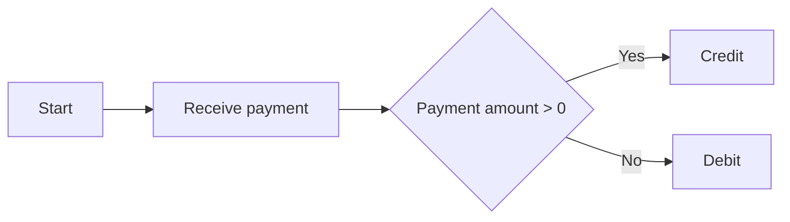
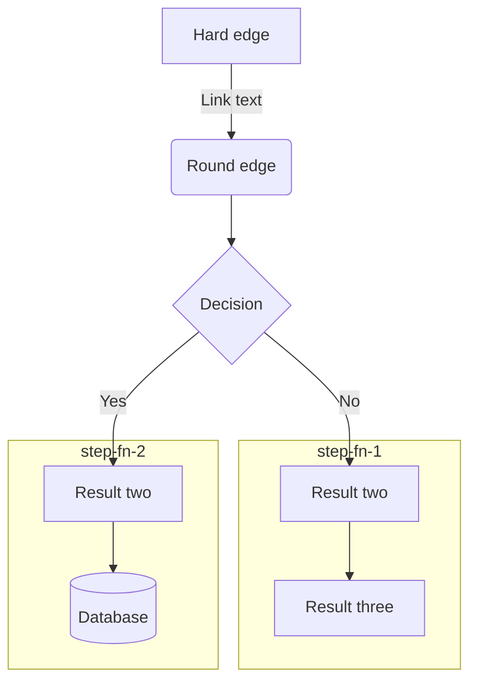
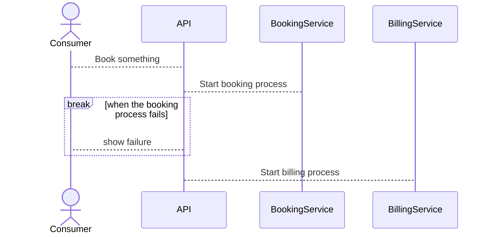
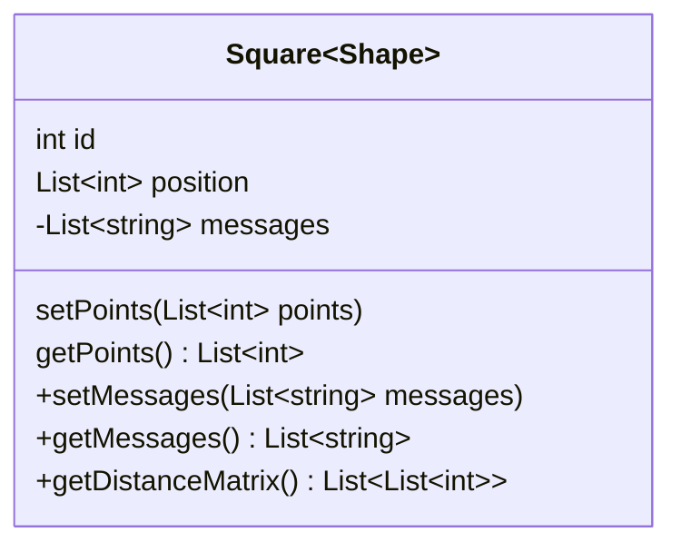
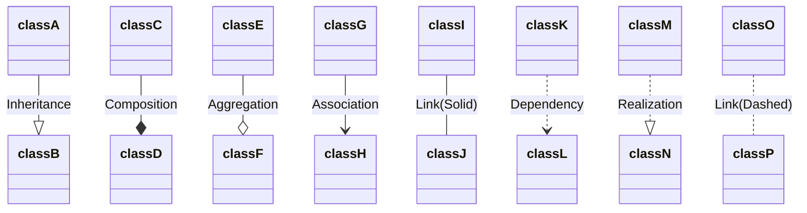
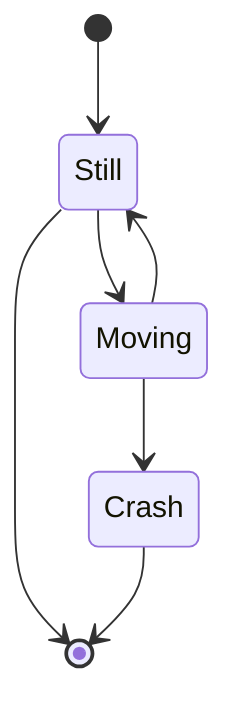
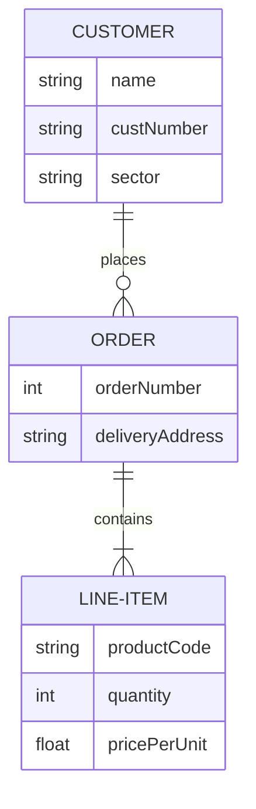

# Mermaid 


## Table of Contents

- [Mermaid](#Mermaid)
  - [1. Overview](#Overview)
  - [1. Mermaid](#1-mermaid)
    - [1.1. Mermaid](#11-mermaid)

# Overview

Mermaid is a diagramming tool that uses Markdown-like syntax to generate diagrams in our markdown files. It is a great tool for creating flowcharts, sequence diagrams, and other diagrams that we can use to visualize our code.

Mermaid markdown is supported by many third party [vendors](https://mermaid.js.org/ecosystem/integrations.html) and that includes github. This means that we can document our code much better, we could take some of the documentation we would add to confluence and put it here instead

Mermaid offers many features to help us
- a live editor to view our diagrams as we create them
- html support to embed our diagrams in our web pages
- VSC extensions to help us create and view our diagrams

Mermaid allows you to create the following documents
- Flowcharts
- Sequence diagrams
- Gantt diagrams
- Class diagrams
- State diagrams
- Pie charts
- ER diagrams
- User journey diagrams
- Entity relationship diagrams
- Journey diagrams
- Git graphs
- Component diagrams

This will only highlight adding Mermaid to your markdown documents. It will not cover all diagrams or all the different options for each diagram.

# Mermaid Charts

To include a mermaid chart in your markdown document you need to specify that you are adding mermaid code.

        ```mermaid
        Mermaid markdown here
        ```

## Flowcharts

If we had a payment business and received a payment amount, from the amount we would need to determine if the payment was a debit or credit. We could write this down but its often clearer to show this in a flowchart.

If we enter the following we are creating a flowchart that flows from left to right

        ```mermaid
        flowchart LR
            A[Start] --> B[Receive payment]
            B --> C{Payment amount > 0}
            C --> |Yes| D[Credit]
            C --> |No| E[Debit]
        ```



For a flowchart we can 
- specify the direction of the flowchart (top down, left - right, right - left, bottom - up)
- specify the style of the arrows
- specify the style of the nodes

Mermaid flowchart shapes can be found [here](https://mermaid-js.github.io/mermaid/#/flowchart?id=flowchart-diagram-syntax)




## Sequence Diagrams

A sequence diagram shows the sequence of messages between objects in a system. It shows the order of the messages and the objects that send and receive the messages.

For a sequence diagram we can
- specify the style of the arrows
- specifies loops and conditions
- add notes to the diagram
- add sequence numbering
- and so much more




## Class Diagrams

A class diagram shows the classes in a system and the relationships between the classes. It shows the attributes and methods of each class and the relationships between the classes.





## State Diagrams

State diagrams show the states of an object and the transitions between the states. It shows the events that cause the transitions and the actions that result from the transitions.



## Entity Diagrams

enity diagrams show the entities in a system and the relationships between the entities. It shows the attributes of each entity and the relationships between the entities.



## User Jouneys

User journeys show the steps a user takes to complete a task. It shows the steps the user takes and the actions that result from the steps.

```mermaid
journey
    title My working day
    section Go to work
      Make tea: 5: Me
      Go upstairs: 3: Me
      Do work: 1: Me, Cat
    section Go home
      Go downstairs: 5: Me
      Sit down: 5: Me```


## Gantt Charts

Gantt charts show the tasks in a project and the time taken to complete the tasks. It shows the start and end dates of the tasks and the dependencies between the tasks.

```mermaid
%%{init: {"pie": {"textPosition": 0.5}, "themeVariables": {"pieOuterStrokeWidth": "5px"}} }%%
pie showData
    title Key elements in Product X
    "Calcium" : 42.96
    "Potassium" : 50.05
    "Magnesium" : 10.01
    "Iron" :  5
```

## Supporting Links

[mermaid website](https://mermaid-js.github.io/mermaid/#/)

[Mermaid live editor](https://mermaid.live/edit#pako:eNplUU1PwzAM_Ssm507cK1QEQoB24LBde3ETr4lI45A6oGrafydtxDQJn6z3Efs5Z6XZkGrVTF-ZgqYXh2PCqQ9QKmISp13EIPDknab_8DMPFdz4Xdft2YYW3sl7hrVvwPIPYCJYOD9WrWeORYJerLakPyu61uq4PvLqRiuAI7owC9glsrYcTHJYDRRMbT5YCNKm5hNU8wHFcUAPYjkXZoaHId13MdE3On9Xjdu4Mm9bvoW3RCi3VNeVfCXNmmDgLDcZCrG7brpn7xcYmc3mVo2aKE3oTLnseUV6JZYm6lVbWkMnzF561YdLkWIWPi5Bq1ZSpkblaFD-PqKCl18UC4uC)


# Further Reading


