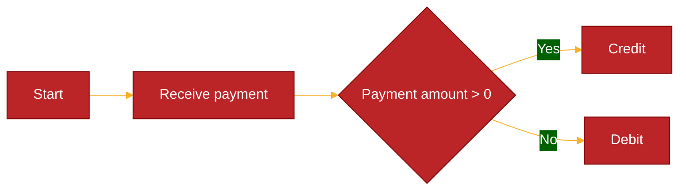

# Mermaid 

## Overview

Mermaid is a diagramming tool that uses Markdown-like syntax to generate diagrams in our markdown files. It is a great tool for creating flowcharts, sequence diagrams, and other diagrams that we can use to visualize our code.

Mermaid markdown is supported by many third party [vendors](https://mermaid.js.org/ecosystem/integrations.html) and that includes github. This means that we can document our code much better, we could take some of the documentation we would add to confluence and put it here instead

Mermaid offers many features to help us
- a live editor to view our diagrams as we create them
- html support to embed our diagrams in our web pages
- VSC extensions to help us create and view our diagrams

Mermaid allows you to create the following documents
- Flowcharts
- Sequence diagrams
- Gantt diagrams
- Class diagrams
- State diagrams
- Pie charts
- ER diagrams
- User journey diagrams
- Entity relationship diagrams
- Journey diagrams
- Git graphs
- Component diagrams

This will only highlight adding Mermaid to your markdown documents. It will not cover all diagrams or all the different options for each diagram.

## Mermaid Charts

To include a mermaid chart in your markdown document you need to specify that you are adding mermaid code, you will need to surround the mermaid code with the following

        ```mermaid
        Mermaid markdown here
        ```

If you decided you wanted to add a flowchart you would add the following

        ```mermaid
        flowchart LR
            A[Start] --> B[Receive payment]
            B --> C{Payment amount > 0}
            C --> |Yes| D[Credit]
            C --> |No| E[Debit]
        ```

This would create a flowchart as follows.


This flowchart is a definite improvement to the current documentation we create, but it would be even better if we could add a custom colour pallette. The downside is that we have to add the custom colour pallette for each diagram we create and there are slightly different attributes we can set.

        ```mermaid
        %%{
            init: {
            'theme': 'base',
            'themeVariables': {
                'primaryColor': '#BB2528',
                'primaryTextColor': '#fff',
                'primaryBorderColor': '#7C0000',
                'lineColor': '#F8B229',
                'secondaryColor': '#006100',
                'tertiaryColor': '#fff'
            }
        }}%%
        flowchart LR
            A[Start] --> B[Receive payment]
            B --> C{Payment amount > 0}
            C --> |Yes| D[Credit]
            C --> |No| E[Debit]
        ```

This creates a more attractive diagram



Several of the different diagrams will need different variables to be set for the colours and feel. 
[Theme variables](https://mermaid.js.org/config/theming.html#theme-variables-reference-table)

## Mermaid Chart Types

[Flowchart](https://github.com/ShareMyWebStuff/mermaid-presentation/blob/main/1-FLOWCHARTS.md)
[Sequence charts](https://github.com/ShareMyWebStuff/mermaid-presentation/blob/main/2-SEQUENCE.md)
[Class diagrams](https://github.com/ShareMyWebStuff/mermaid-presentation/blob/main/3-CLASS.md)
[State diagrams](https://github.com/ShareMyWebStuff/mermaid-presentation/blob/main/4-STATE.md)
[ER diagrams](https://github.com/ShareMyWebStuff/mermaid-presentation/blob/main/5-ERD.md)
[User journey diagrams](https://github.com/ShareMyWebStuff/mermaid-presentation/blob/main/6-USER_JOURNEY.md)
[Gantt charts](https://github.com/ShareMyWebStuff/mermaid-presentation/blob/main/7-GANTT.md)
[Pie charts](https://github.com/ShareMyWebStuff/mermaid-presentation/blob/main/8-PIE.md)
[Quadrant diagrams](https://github.com/ShareMyWebStuff/mermaid-presentation/blob/main/9-QUADRANT.md)
[Requirement diagrams](https://github.com/ShareMyWebStuff/mermaid-presentation/blob/main/10-REQUIREMENT.md)
[Gitgraph diagrams](https://github.com/ShareMyWebStuff/mermaid-presentation/blob/main/11-GITGRAPH.md)
[C4 diagrams](https://github.com/ShareMyWebStuff/mermaid-presentation/blob/main/12-C4.md)


## Supporting Links

[mermaid website](https://mermaid-js.github.io/mermaid/#/)

[Mermaid live editor](https://mermaid.live/edit#pako:eNplUU1PwzAM_Ssm507cK1QEQoB24LBde3ETr4lI45A6oGrafydtxDQJn6z3Efs5Z6XZkGrVTF-ZgqYXh2PCqQ9QKmISp13EIPDknab_8DMPFdz4Xdft2YYW3sl7hrVvwPIPYCJYOD9WrWeORYJerLakPyu61uq4PvLqRiuAI7owC9glsrYcTHJYDRRMbT5YCNKm5hNU8wHFcUAPYjkXZoaHId13MdE3On9Xjdu4Mm9bvoW3RCi3VNeVfCXNmmDgLDcZCrG7brpn7xcYmc3mVo2aKE3oTLnseUV6JZYm6lVbWkMnzF561YdLkWIWPi5Bq1ZSpkblaFD-PqKCl18UC4uC)


